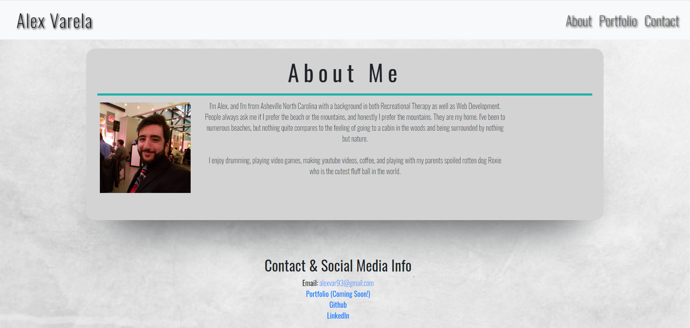
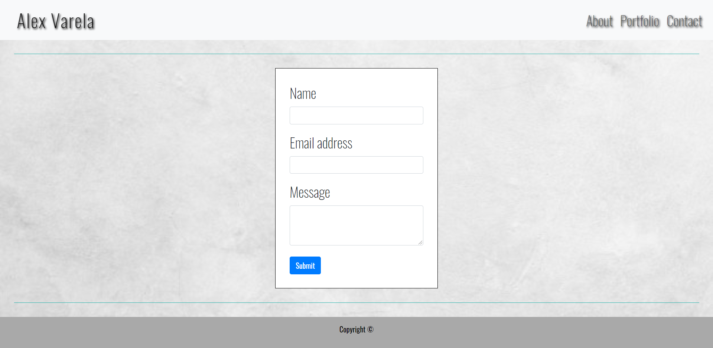
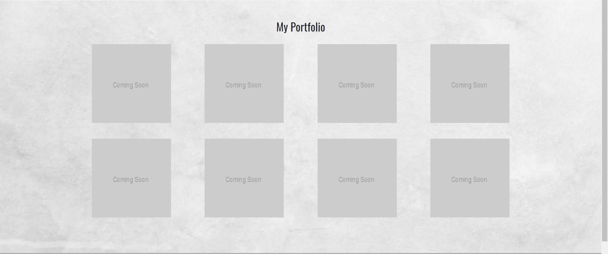
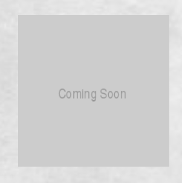
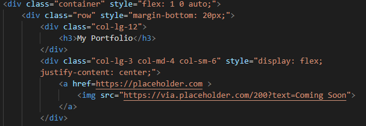
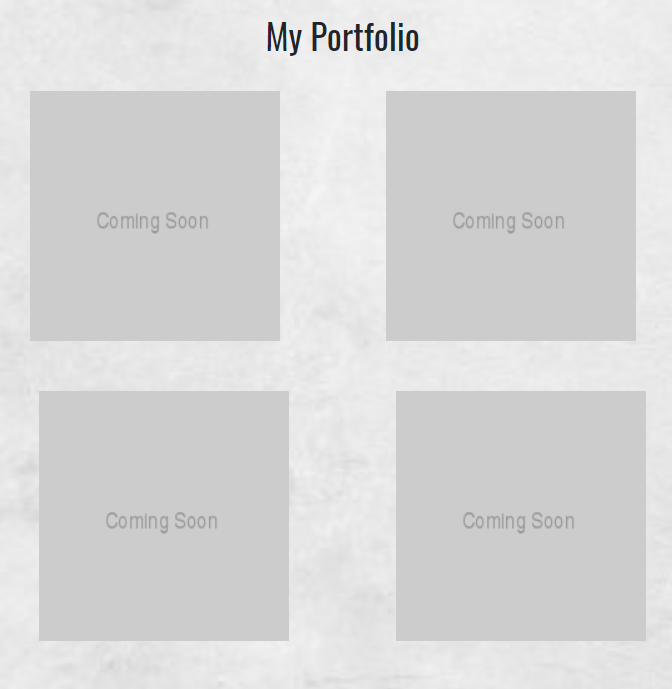
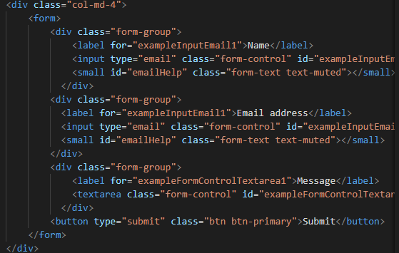
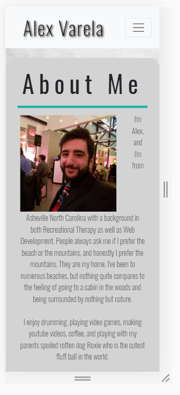
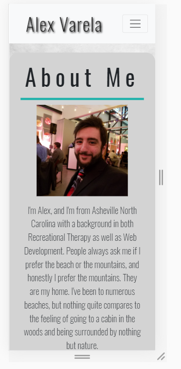

# Responsive Portfolio #

For this project, we were tasked with creating a webpage that featured three 
parts to it:

* An About Me Page

* A Contact page

* A portfolio page

While these were the three files we needed to create, there was quite a bit of requirements that we had to meet in order to complete this assignment. We had to 
make use of the Bootstrap grid system, make a consistent and responsive nav-bar, and make sure everything translated well to mobile devices.

### Header

First off I created the nav-bar. Instead of creating one from scratch, we were given the ability to use Bootstrap and it's proprietary elements. So I selected a bar that looked decent and got to work on it. I placed my name in the top left, and the top right featured an About Me page with some basic information, a portfolio page (which is going to be updated over time, along with the website itself), and a contact me page.

Getting the header to have text left and right was a simple matter of text aligning and was relatively simple. I then added a font of my own and then a bit of shadowing just to make it look a little less boring. 

As a note, most of what is here will likley change quite a bit as the course continues. The most important part of this assignment was to create a skeleton for our webpage which we can make ours and unqie to us over time as we learn more and more about html, css, and javascript.

### Body

For the body section, the hardest part was not the coding but rather thinking of how I wanted my website to look. With enough time and patience I could craft something more refined and fitting of what I want, but I am happy with my current result.

The most intensive was the index.html page, or my about me page which featured a small bio and picture. In order to make sure everything fit properly, I made use of the Bootstrap grid system to have my columns add up to exactly 12. I created a container to house it all and added a picture for the first 2 columns, and then a bio section that took up the remaining 10 columns. 

In my pages that featured a container, I made sure to use a style element so that each page had its own unique layout. This was my choice as opposed to using my css style sheet and having only one container selector and applying that same style to every file I created. 

### Portfolio

The most difficult part of my project was trying to fix my portfolio page. I used img place holders that would serve as clickable links to direct the user to each of the projects I had. Of course since this is in the infant stages of the course, we have no projects to display, so I chose to add greyed out boxes with "coming soon" in each. 

The difficulty in this section wwas in creating a layout that made sense and that was responsive to different screen sizes. I used the Bootstrap layout once more, but this time I included different column sizes in each element that would respond to small, large, and medium screens as you can see in the screenshot below.

Alongisde this, I made use of the flexbox mechanics to align things proplerly. The pictures by themselves had no margins so they all stuck together. To fix this I simply added in a bottom margin to give each space, and then I used the "justify-content" property to make sure things lined up well. Without this property, the items on the page will not line up in the center and would be slighlty left or right as you can see from this screenshot. Notice the margin is slightly off center.

### Contact

For my contact page, I used a form from Bootstrap and altered the elements to display "Name", "Email", and "Message" instead of the box titles that were present in the default Bootstrap element. Please note that this section does not function correctly yet and that this is simply to establish the layout.

Changing the elements within this form was relatively simple and painless. 

### Footer

One of the other more significant issues I had was with displaying the footer correctly. Now, it stays at the bottom of the page. But prior to my fix it would sit right below the last element with no margin. In order to accomplish this, I used flexbox and made the flex-direction oriented to columns and pushed it down with a few other properties. 

### Media Queries

A problem I ran into was attempting to make my pages mobile friendly. Once I hit around 400px width, the text was running in single lines next to my picture in the About Me section and it looked awful.

After adding in a section for this in my stylesheet that adjusted the float, margins, and text size after 400px, I was able to fix this and make it look much better.

### Summary

This project was quite a time consuming adventure for me. The layout was difficult to picture in my mind, but I have since discovered some unique tools to help me picture the layout more clearly, on top of just drawing it out. I learned a good deal from this and managed to get a bit better at understanding some concepts such as floating, positioning, media queries, and flex box. While the end result is not even close to being finished for me, this is a great first step and a good foundation to edit throughout the rest of the course.

